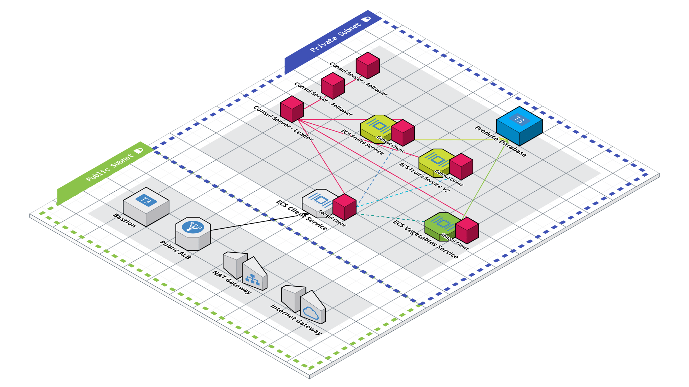

# 🍎🥦 CzarFoods — Multiservice App on ECS Fargate
 
A fully Terraform-provisioned multiservices application for fruits and vegetables, leveraging **Amazon ECS Fargate** and a **Bastion Host** for secure access. Services are built using [nicholasjackson/fake-service](https://github.com/nicholasjackson/fake-service).
 

---

## 📸 Architecture Diagram

<!-- Add your architecture diagram or screenshot below -->



---

## 🧱 Stack
 
| Tool | Purpose |
|------|---------|
| **Terraform** | 100% Infrastructure as Code |
| **AWS ECS Fargate** | Serverless container orchestration |
| **Bastion Host** | Secure SSH access into the private network |
| **nicholasjackson/fake-service** | Simulated microservices for fruits & vegs |
 
---
 
## 🗂️ Project Structure
 
```
.
├── main.tf
├── variables.tf
├── outputs.tf
├── modules/
│   ├── vpc/
│   ├── ecs/
│   ├── alb/
│   └── bastion/
├── images/
│   └── architecture.png   ← place your diagrams here
└── README.md
```
 
---
 
## 🚀 Services
 
| Service | Port | Description |
|---------|------|-------------|
| **Client Service** | 9090 | Entry point — routes to downstream services |
| **Fruits Service** | 9090 | Returns fake fruits data |
| **Vegs Service** | 9090 | Returns fake vegetables data |
 
All services use [nicholasjackson/fake-service](https://github.com/nicholasjackson/fake-service) as the container image.
 
---
 
## 🔐 Security Model
 
- The **Client ALB** accepts public traffic on port 80
- The **Client Service** only accepts traffic from the Client ALB
- Downstream ALBs (Fruits, Vegs) only accept traffic **from the Client Service SG**
- All ECS tasks communicate via **Security Group rules**, not open CIDRs
- The **Bastion Host** provides SSH access to private resources without exposing them publicly
---
 
## ⚙️ Prerequisites
 
- [Terraform](https://developer.hashicorp.com/terraform/install) `>= 1.3`
- AWS CLI configured with appropriate credentials
- An S3 bucket + DynamoDB table for remote state (optional but recommended)
---
 
## 🛠️ Usage
 
```bash
# 1. Clone the repo
git clone https://github.com/your-username/czarfoods.git
cd czarfoods
 
# 2. Initialize Terraform
terraform init
 
# 3. Review the plan
terraform plan
 
# 4. Apply
terraform apply
```
 
---


## 📄 License
